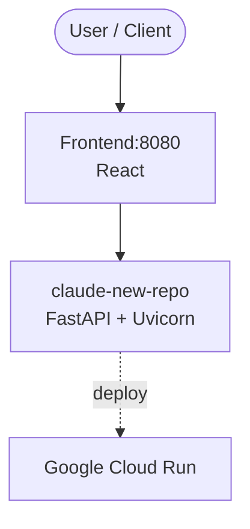

# Context Map — `claude-new-repo`

> Auto-generated architecture & deployment context map. Summarizes the core application, container/cloud footprint, and database connections. Regenerate after significant structural changes.

**Repo:** `avnit/claude-new-repo` · **Original** · Public · Primary language: - · Default branch: `main` · Files: 4

## 1. Core application

claude-new-repo

- **Frameworks / runtime:** FastAPI + Uvicorn, React
- **Listens on port(s):** 8080

## 2. Containers & cloud applications

**Detected cloud platforms / services:** Google Cloud Run, Terraform

## 3. Database connections

_No database drivers or connection strings detected._

## 4. Architecture diagram

## 5. Security posture

- No open Dependabot alerts or static-scan findings recorded.

---
_Generated by repo context-mapping pass on 2026-08-13._